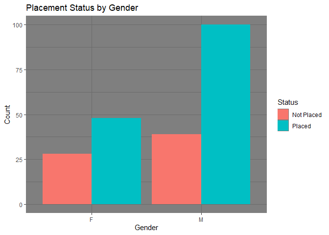
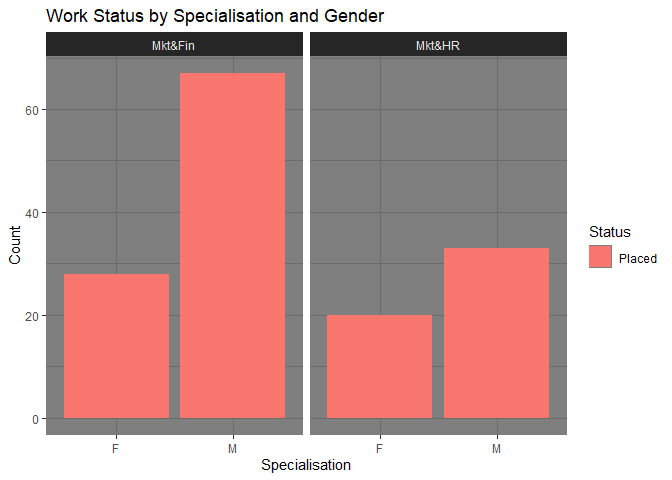

Campus Recruitment \| Kaggle
================
Miracle Samuel Samosir
2022-05-19

# Classification Project

We will predict the placement status by some of the factors that may or
may not influence the placement. So on this project we will answer some
of the question:

1.  Which factor influenced a candidate in getting placed?
2.  Does percentage matters for one to get placed?
3.  Which degree specialization is much demanded by corporate?

# Importing

## Importing Libraries

We import useful libraries such as dplyr for data manipulation, ggplot2
for visualizing data, rpart for decision tree modeling, and e1071 for
naive bayes classifier.

``` r
library(dplyr)
library(ggplot2)
library(rpart)
library(e1071)
```

## Importing Data

The data was downloaded from
<https://www.kaggle.com/datasets/benroshan/factors-affecting-campus-placement>

``` r
data <- read.csv("C:\\Users\\User\\Downloads\\archive\\Placement_Data_Full_Class.csv")
head(data)
```

    ##   sl_no gender ssc_p   ssc_b hsc_p   hsc_b    hsc_s degree_p  degree_t workex
    ## 1     1      M 67.00  Others 91.00  Others Commerce    58.00  Sci&Tech     No
    ## 2     2      M 79.33 Central 78.33  Others  Science    77.48  Sci&Tech    Yes
    ## 3     3      M 65.00 Central 68.00 Central     Arts    64.00 Comm&Mgmt     No
    ## 4     4      M 56.00 Central 52.00 Central  Science    52.00  Sci&Tech     No
    ## 5     5      M 85.80 Central 73.60 Central Commerce    73.30 Comm&Mgmt     No
    ## 6     6      M 55.00  Others 49.80  Others  Science    67.25  Sci&Tech    Yes
    ##   etest_p specialisation mba_p     status salary
    ## 1    55.0         Mkt&HR 58.80     Placed 270000
    ## 2    86.5        Mkt&Fin 66.28     Placed 200000
    ## 3    75.0        Mkt&Fin 57.80     Placed 250000
    ## 4    66.0         Mkt&HR 59.43 Not Placed     NA
    ## 5    96.8        Mkt&Fin 55.50     Placed 425000
    ## 6    55.0        Mkt&Fin 51.58 Not Placed     NA

# EDA

## Variables and their relationship.

1)  Work status by gender

<!-- -->

    ## # A tibble: 4 x 4
    ## # Groups:   gender [2]
    ##   gender status         n percentage
    ##   <chr>  <chr>      <int>      <dbl>
    ## 1 F      Not Placed    28      0.368
    ## 2 F      Placed        48      0.632
    ## 3 M      Not Placed    39      0.281
    ## 4 M      Placed       100      0.719

2)  Work status by Degree Specialization and Gender

``` r
special <- data %>% 
  select(specialisation, gender, status) %>% 
  filter(status == 'Placed') %>% 
  group_by(specialisation, gender, status) %>% 
  count() %>% 
  summarise(n, percentage = ifelse(specialisation == 'Mkt&Fin', n/length(which(data$specialisation == 'Mkt&Fin')), 
            n/length(which(data$specialisation == 'Mkt&HR'))))
```

    ## `summarise()` has grouped output by 'specialisation', 'gender'. You can
    ## override using the `.groups` argument.

``` r
special
```

    ## # A tibble: 4 x 5
    ## # Groups:   specialisation, gender [4]
    ##   specialisation gender status     n percentage
    ##   <chr>          <chr>  <chr>  <int>      <dbl>
    ## 1 Mkt&Fin        F      Placed    28      0.233
    ## 2 Mkt&Fin        M      Placed    67      0.558
    ## 3 Mkt&HR         F      Placed    20      0.211
    ## 4 Mkt&HR         M      Placed    33      0.347

## Visualization

1)  Work status by gender

``` r
by_gender_status_vis <- ggplot(by_gender_status, aes(gender,n, fill = status)) +
  geom_col(position = "dodge") + 
  xlab("Gender") + 
  ylab("Count") + 
  ggtitle("Placement Status by Gender") +
  scale_fill_discrete("Status") +
  theme_dark()
by_gender_status_vis
```

<!-- -->

2)  Work status by employee specialisation

``` r
by_specialisation <- ggplot(special, aes(gender, n, fill = status)) +
  geom_col(position = "Dodge") + ggtitle("Work Status by Specialisation and Gender") + 
  xlab("Specialisation") + ylab("Count") +
  scale_fill_discrete("Status") + facet_wrap(~specialisation) + theme_dark()
by_specialisation
```

<!-- -->

# Pre-processing

## Creating function to check NA values in every column of the data

We then define a function that will count the NA values (if exist) in
every column in our data

``` r
column_names = c()
na_count = c()
check_na <- function(data){
  for (i in 1:length(data)){
    column_names = c(colnames(data[i]),column_names)
    na_count = c(sum(is.na(data[i])),na_count)
    na_val = data.frame(column_names,na_count)
  }
  print(na_val)
}
check_na(data)
```

    ##      column_names na_count
    ## 1          salary       67
    ## 2          status        0
    ## 3           mba_p        0
    ## 4  specialisation        0
    ## 5         etest_p        0
    ## 6          workex        0
    ## 7        degree_t        0
    ## 8        degree_p        0
    ## 9           hsc_s        0
    ## 10          hsc_b        0
    ## 11          hsc_p        0
    ## 12          ssc_b        0
    ## 13          ssc_p        0
    ## 14         gender        0
    ## 15          sl_no        0

# Modeling

## Preparing data for modelling

1)  Data Structure

``` r
str(data)
```

    ## 'data.frame':    215 obs. of  15 variables:
    ##  $ sl_no         : int  1 2 3 4 5 6 7 8 9 10 ...
    ##  $ gender        : chr  "M" "M" "M" "M" ...
    ##  $ ssc_p         : num  67 79.3 65 56 85.8 ...
    ##  $ ssc_b         : chr  "Others" "Central" "Central" "Central" ...
    ##  $ hsc_p         : num  91 78.3 68 52 73.6 ...
    ##  $ hsc_b         : chr  "Others" "Others" "Central" "Central" ...
    ##  $ hsc_s         : chr  "Commerce" "Science" "Arts" "Science" ...
    ##  $ degree_p      : num  58 77.5 64 52 73.3 ...
    ##  $ degree_t      : chr  "Sci&Tech" "Sci&Tech" "Comm&Mgmt" "Sci&Tech" ...
    ##  $ workex        : chr  "No" "Yes" "No" "No" ...
    ##  $ etest_p       : num  55 86.5 75 66 96.8 ...
    ##  $ specialisation: chr  "Mkt&HR" "Mkt&Fin" "Mkt&Fin" "Mkt&HR" ...
    ##  $ mba_p         : num  58.8 66.3 57.8 59.4 55.5 ...
    ##  $ status        : chr  "Placed" "Placed" "Placed" "Not Placed" ...
    ##  $ salary        : int  270000 200000 250000 NA 425000 NA NA 252000 231000 NA ...

We see that the data is not ready for modeling because of the different
data types such as string and also some of unused column for modeling.
Therefore we need to change them to dummy variables (set them as factor)
and remove some of the columns. The code for doing that is presented
below:

2)  Data Manipulation

``` r
data_model <- data %>% 
  select(-sl_no, -salary) %>% 
  mutate(gender = as.integer(as.factor(gender)), ssc_b = as.integer(as.factor(ssc_b)), 
         hsc_b = as.integer(as.factor(hsc_b)), hsc_s = as.integer(as.factor(hsc_s)), 
         degree_t = as.integer(as.factor(degree_t)), workex = as.integer(as.factor(workex)), 
         specialisation = as.integer(as.factor(specialisation)),
         status = as.integer(as.factor(status)))
str(data_model)
```

    ## 'data.frame':    215 obs. of  13 variables:
    ##  $ gender        : int  2 2 2 2 2 2 1 2 2 2 ...
    ##  $ ssc_p         : num  67 79.3 65 56 85.8 ...
    ##  $ ssc_b         : int  2 1 1 1 1 2 2 1 1 1 ...
    ##  $ hsc_p         : num  91 78.3 68 52 73.6 ...
    ##  $ hsc_b         : int  2 2 1 1 1 2 2 1 1 1 ...
    ##  $ hsc_s         : int  2 3 1 3 2 3 2 3 2 2 ...
    ##  $ degree_p      : num  58 77.5 64 52 73.3 ...
    ##  $ degree_t      : int  3 3 1 3 1 3 1 3 1 1 ...
    ##  $ workex        : int  1 2 1 1 1 2 1 2 1 1 ...
    ##  $ etest_p       : num  55 86.5 75 66 96.8 ...
    ##  $ specialisation: int  2 1 1 2 1 1 1 1 1 1 ...
    ##  $ mba_p         : num  58.8 66.3 57.8 59.4 55.5 ...
    ##  $ status        : int  2 2 2 1 2 1 1 2 2 1 ...

As we see, the value in the column of the dataset already changed, so
the data is ready to use.

## Train Test Split

Before modeling, we will define a function that will split the data into
train and test data. The train data will be use to train the model and
the test data will be use to validate the result later after the
modeling process. We split 80% of the data for training and the rest for
testing.

``` r
create_train_test <- function(data, size = 0.8, train = TRUE) {
  n_row = nrow(data)
  total_row = size * n_row
  train_sample <- 1:total_row
  if (train == TRUE) {
    return (data[train_sample, ])
  } else {
    return (data[-train_sample, ])
  }
}

train <- create_train_test(data_model, train = T)
test <- create_train_test(data_model, train = F)
```

# Classification

## 1) Decision Tree

After splitting the data into training and testing, we create a decision
tree model using the training data. Then we will predict with the
testing data. Lastly we will use accuracy as the performance metrics for
the model.

``` r
model <- rpart(status~., train, method = 'class')
prediction <- predict(model, test, type = 'class')
matrix <- table(test$status, prediction)
acc <- sum(diag(matrix))/sum(matrix)
print(paste('The Accuracy of the model is', round(acc,4)))
```

    ## [1] "The Accuracy of the model is 0.7209"

The decision tree model successfully predict 72% of the test data
output.

## 2) Naive Bayes

We might want to try another classification algorithm for modeling that
might give better results. So we will use naive bayes classifier.

``` r
model2 <- naiveBayes(status~., train)
prediction2 <- predict(model2, test)
matrix2 <- table(test$status, prediction2)
acc2 <- sum(diag(matrix2))/sum(matrix2)
print(paste('The Accuracy of the model is', round(acc2,4)))
```

    ## [1] "The Accuracy of the model is 0.6977"

The naive bayes model successfully predict almost 70% of the test data
output.

# Conclusion

Because our Decision Tree model has a higher accuracy, we will use the
model to answer the question.

## 1) Which factor influenced a candidate in getting placed?

``` r
model$variable.importance
```

    ##     ssc_p     hsc_p  degree_p     mba_p 
    ## 26.304911 13.715063  8.251260  2.076703

To determine which of the variable that influence the model the most, we
see the score below of the variable. As the result above, we see that
there is 4 variable that influence the most. If we sort from the highest
to the lowest it will be ssc_p \> hsc_p \> degree_p \> mba_p. The
secondary percentage is the factor that influence the work status
(placed/not placed) the most, followed by highschool percentage, degree
percentage and the last is the mba percentage.

## 2) Does percentage matters for one to get placed?

As we see on number 1 answer, score percentage is the factor that
influence the most. So it matters.

## 3) Which degree specialization is much demanded by corporate?

``` r
by_specialisation
```

<!-- -->

As the graphic shows above, the most demanded specialisation by
corporate is Mkt&Fin. Both man and woman have a higher number in Mkt&Fin
than in Mkt&HR.
